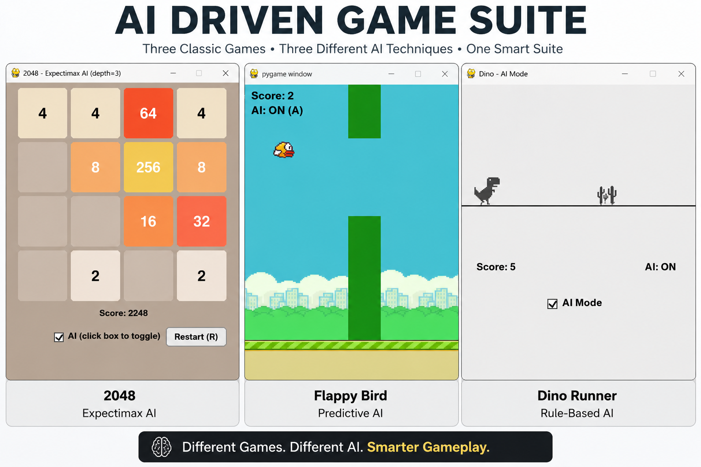
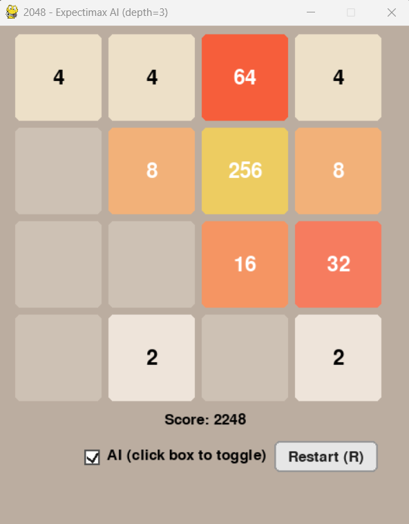
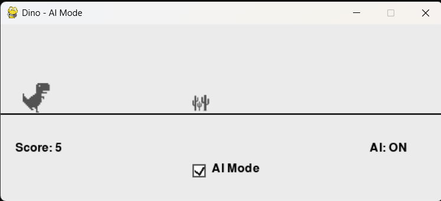
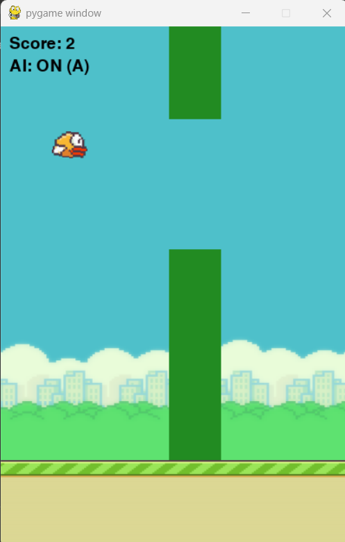

# AI-Driven Game Suite


A Python and Pygame project showcasing three classic games enhanced with different Artificial Intelligence techniques.

Each game supports both **Manual Mode** and **AI Mode**, demonstrating different approaches to AI-driven gameplay in an interactive environment.

> **Note:** This project was developed as part of a B.Tech AIML team project.



---

## Overview

The AI-Driven Game Suite combines three classic games into a single project to demonstrate different Artificial Intelligence techniques in game development. Each game can be played manually or controlled by an AI agent, allowing users to compare human gameplay with automated decision-making.

The project was designed to demonstrate practical AI concepts through interactive gameplay while maintaining a clean and modular codebase.

---

## Features

- Three fully playable games
- Manual Mode and AI Mode
- Real-time AI decision-making
- Interactive graphical interface using Pygame
- Lightweight implementation in Python
- Modular project structure
- Easy to extend with additional games and AI techniques

---

## AI Techniques

| Game | AI Technique | Description |
|------|--------------|-------------|
| 2048 | Expectimax Search | Strategic tile movement using heuristic evaluation |
| Dino Runner | Rule-Based AI | Automatic obstacle avoidance |
| Flappy Bird | Predictive AI | Predicts when to flap through pipes |

Each game demonstrates a different approach to solving gameplay challenges using Artificial Intelligence.

---

## Games Included

### 2048

A recreation of the classic 2048 puzzle game featuring an optional Expectimax AI capable of making strategic moves using heuristic evaluation.

**Highlights**

- Manual gameplay
- Expectimax AI
- Score tracking
- Restart functionality

---

### Dino Runner

A recreation of the Chrome Dino game where the player jumps over obstacles while an optional rule-based AI automatically controls the dinosaur.

**Highlights**

- Manual gameplay
- Rule-based AI
- Dynamic obstacle generation
- Live score tracking

---

### Flappy Bird

A Flappy Bird implementation with an optional predictive AI controller that automatically navigates through incoming pipes.

**Highlights**

- Manual gameplay
- Predictive AI
- Infinite gameplay
- Live score display

---

## Screenshots

### 2048



### Dino Runner



### Flappy Bird



---

## Project Structure

```text
AI-Driven-Game-Suite/
│
├── 2048.py
├── DinoGame.py
├── Flappy_Bird.py
│
├── docs/
│   └── AI_Driven_Game_Suite_Technical_Report.pdf
│
├── screenshots/
│   ├── 2048.png
│   ├── Dino.png
│   └── Bird.png
│
├── README.md
├── LICENSE
└── .gitignore
```

---

## Getting Started

### Requirements

- Python 3.10 or later
- Pygame

Install Pygame:

```bash
pip install pygame
```

---

## Running the Games

Run any game individually.

### 2048

```bash
python 2048.py
```

### Dino Runner

```bash
python DinoGame.py
```

### Flappy Bird

```bash
python Flappy_Bird.py
```

---

## Controls

### 2048

| Action | Key |
|--------|-----|
| Move Tiles | Arrow Keys |
| Toggle AI | A |
| Restart | R |

---

### Dino Runner

| Action | Key |
|--------|-----|
| Jump | Space |
| Toggle AI | A |
| Restart | R |

---

### Flappy Bird

| Action | Key |
|--------|-----|
| Flap | Space |
| Toggle AI | A |
| Restart | R |

---

## Technologies Used

- Python
- Pygame
- Object-Oriented Programming (OOP)
- Artificial Intelligence
- Expectimax Search
- Rule-Based Systems
- Predictive Algorithms

---

## My Contribution

This project was developed as part of a B.Tech AIML team project.

I was responsible for the majority of the technical implementation, including:

- Developing and integrating the game logic
- Implementing and refining the AI behaviour
- Debugging and testing the games
- Organizing the project repository
- Preparing the technical documentation

---

## Technical Report

A detailed report explaining the project architecture, implementation, and AI techniques is available here:

[AI_Driven_Game_Suite_Technical_Report.pdf](docs/AI_Driven_Game_Suite_Technical_Report.pdf)

---

## Future Improvements

- Add additional AI-powered games
- Improve AI performance using reinforcement learning
- Enhance AI difficulty levels
- Improve animations and sound effects
- Enhance the graphical user interface
- Add player statistics and analytics

---

## Acknowledgements

This project was developed as part of the Artificial Intelligence and Machine Learning (AIML) curriculum during my B.Tech program.

---

## License

This project is licensed under the MIT License.

See the **LICENSE** file for more information.
---

If you found this project interesting, feel free to explore the repository and share your feedback.